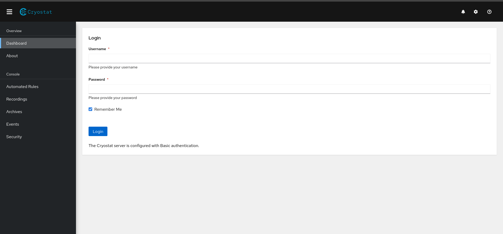

# Cryostat Local Development
Cryostat itself has good documentation on development testing on the main [GitHub repository](https://github.com/cryostatio/cryostat#test).

The rest of this doc will assume that your local cryostat Git repository is located in the path `~/workspace/cryostat`
For ease of access, the testing portion of the cryostat README will be copied and augmented with (extra useful information) below.

## REQUIREMENTS
### Build Requirements:
- Git
- JDK17+
- Maven 3+
- Podman 2.0+

Most likely a developer will be working from a Fedora based host, so installation of these dependencies are as easy as running 
```bash
sudo dnf install git
sudo dnf install maven
sudo dnf install podman
```
_Remember to add the path to your Java binary to $PATH as noted in the guide below._ 
[OpenJDK 17 installation guide](https://computingforgeeks.com/install-oracle-java-openjdk-fedora-linux/)


### Run Requirements:
- Kubernetes/OpenShift, Podman/Docker, or other container platform

## LOCAL TESTING

### Setup Dependencies

* Clone [cryostat-core](https://github.com/cryostatio/cryostat-core) via it's [instructions](https://github.com/cryostatio/cryostat-core/blob/main/README.md) in another directory of your workspace
* Make sure that your `cryostat-core` version matches the `cryostat` [pom.xml dependency version](https://github.com/cryostatio/cryostat/blob/main/pom.xml#L71) that you are developing or testing. If not then `git checkout` the correct `-core` tag.
    e.g. 
    ```bash
    $ git fetch --tags
    $ git checkout tags/v2.13.0
    Previous HEAD position was ddc01b1 chore(pom): set version to 2.12.0 (#150)
    HEAD is now at 44f2209 chore(pom): set version to 2.13.0
    ```
* Then run `mvn install` in `-core` to install the correctly versioned dependency for `cryostat` to use
    ```bash
    $ pwd 
    ~/workspace/cryostat-core
    $ mvn install
    # output omitted
    ```
* Initialize submodules (in this case: `web-client`) via: 
    ```bash
    $ pwd 
    ~/workspace/cryostat
    $ git submodule init && git submodule update
    ```

### Build and run project locally in development hot-reload mode
This is the main command you will be running to test your cryostat changes.
```bash
$ sh devserver.sh
```
* `sh devserver.sh` - this will start the Vert.x backend in hot-reload mode, so
any modifications to files in `src/` will cause a re-compilation and re-deploy.
This is only intended for use during development. The `web-client` assets will
not be built and will not be included in the application classpath. To set up
the `web-client` frontend for hot-reload development, see
[cryostat-web Development Server](https://github.com/cryostatio/cryostat-web/blob/main/README.md#development-server).

You will usually run devserver by itself when you have only changed the backend code. If you have changed the frontend code, you will need to run the frontend development server as well.

When using `devserver.sh`, the cryostat server is by default running on port `8181` and its endpoints can be queried using HTTP and GraphQL requests. Try it yourself! 


#### Tutorial: Starting a Cryostat development server
1. Start the development server and wait for it to finish building and deploying
    ```bash
    $ sh devserver.sh
    [INFO] Scanning for projects...
    [INFO] 
    [INFO] ------------------------< io.cryostat:cryostat >------------------------
    [INFO] Building cryostat 2.2.0-SNAPSHOT
    [INFO] --------------------------------[ jar ]---------------------------------
    ...
    ...
    # output omitted
    ...
    ...
    Sep 06, 2022 1:17:53 PM io.cryostat.core.log.Logger info
    INFO: Outgoing WS message: {"meta":{"category":"TargetJvmDiscovery", ... }}
    ```
2. Navigate to `localhost:8181` in your browser and you should see the Cryostat landing page!

     

3. To get past the login page, see details at the bottom of the document here: [Cryostat Login](#Cryostat-web-client-login)

<sub>_**Note:** If you are met with an SSL_ERROR, you may want to navigate to `http://localhost:8181` or read here for help with cryostat SSL certificates. https://github.com/cryostatio/cryostat#user-authentication--authorization_

### Running the frontend development server

If you have `cryostat-web` front-end changes to test, you will need to run the frontend development server as well. This is done in the `cryostat-web` directory:

There are also some environment variables you can set alongside the server to control the configuration. 
```bash
# terminal 1
$ pwd
~/workspace/cryostat
$ CRYOSTAT_DISABLE_SSL=true \ 
CRYOSTAT_DISABLE_JMX_AUTH=true \
CRYOSTAT_CORS_ORIGIN=http://localhost:9000 \
sh devserver.sh # using backslash new-line characters for readability
# output omitted
```
```bash
# terminal 2
$ pwd 
~/workspace/cryostat-web"
$ npm start:dev # or yarn start:dev (we have both package managers in the web-client...)
# output omitted
```

A full list of configuration environment variables can be found on the Cryostat Github [README](https://github.com/cryostatio/cryostat#configuration).

### Running a smoke testing server
You can also test your changes in a realistic environment by running a smoke testing server.
 This is done in the `cryostat` directory:
```bash
$ sh smoketest.sh
```
Again, you can use the same variables as above to configure the server. You can still run the frontend development server alongside this server as well.
```bash
$ CRYOSTAT_DISABLE_SSL=true \
  CRYOSTAT_CORS_ORIGIN=http://localhost:9000 \
  sh smoketest.sh
```
The `smoketest.sh` script starts a `cryostat` container instance inside of a Podman pod along with various other containers.

Let's see this for ourselves!

##### Tutorial: Starting a Cryostat smoke testing server
1. Run `$ mvn clean package -DskipTests` to build the `cryostat` image. More info about `mvn package` is [below](#build-and-push-to-local-podman-image-registry).
2. Start the smoke testing server and wait for it to finish deploying
    ```bash
    $ sh smoketest.sh
    + set -e
    + trap destroyPod EXIT
    + createPod
    ...
    ...
    # output omitted
    ...
    ...
    Sep 06, 2022 1:17:53 PM io.cryostat.core.log.Logger info
    INFO: Outgoing WS message: {"meta":{"category":"TargetJvmDiscovery", ... }}
    ```
3. Navigate to `localhost:8181` in your browser and again you should see the Cryostat landing page.

4. To take a look at all the Podman containers that have been started by `smoketest.sh`:
    <sub> _The --format flag is used to format the output of the `podman ps` command. Otherwise the output is very ugly and unreadable. More info [here](https://docs.podman.io/en/latest/markdown/podman-ps.1.html#format-format)._
    ```bash
    $ podman ps --format "{{.Pod}} || {{.ID}} || {{.RunningFor}} || {{.Names}}"
    b37b47cd72ae || 0a8cec32c00f || 3 minutes ago || b37b47cd72ae-infra
    b37b47cd72ae || 8dfb3c98ba74 || 3 minutes ago || vertx-fib-demo-1
    b37b47cd72ae || ac3494b09005 || 3 minutes ago || vertx-fib-demo-2
    b37b47cd72ae || 2cf7b025779f || 3 minutes ago || vertx-fib-demo-3
    b37b47cd72ae || 45f8794b77cc || 3 minutes ago || quarkus-test
    b37b47cd72ae || d6d7721350dd || 3 minutes ago || quarkus-test-plugin
    b37b47cd72ae || 85bd5e5f8399 || 3 minutes ago || wildfly
    b37b47cd72ae || ae114ddc2bc8 || 3 minutes ago || jfr-datasource
    b37b47cd72ae || b556f059b15e || 3 minutes ago || grafana
    b37b47cd72ae || cd4818a3750b || 3 minutes ago || reports
    b37b47cd72ae || 322fee4119b0 || 3 minutes ago || cryostat
    ```


    You can also take a look at the pod itself.
    ```bash
    $ podman pod ps
    POD ID        NAME          STATUS      CREATED        INFRA ID      # OF CONTAINERS
    b37b47cd72ae  cryostat-pod  Running     3 minutes ago  0a8cec32c00f  11
    ```
    Notice the `POD ID` is the same as the one we saw in the previous example. Seems to be correct!
    <sub>`This section will likely need updating as cryostat grows!...`

    Now... what are these containers? 


That will be answered in a future update to this document. If you are comfortable enough, you can take a look at the [smoketest.sh](https://github.com/cryostatio/cryostat/blob/main/smoketest.sh) script.

Nonetheless, you can see that since these are real physical _(virtual?)_ containers, you are able to create and kill such containers within the pod as you see fit with Podman. 

_e.g. If the previous vertx-fib-demo-1 container id was 8dfb3c98ba74 like above_ 
```bash
# simulate a restarting pod...
$ podman kill 8df && \
  sleep 13 && \ # for convenience, we sleep because the Java Discovery Protocol takes a while to discover the new JVM inside of the container (see https://github.com/cryostatio/cryostat-web/issues/493)
  podman run \
  --name vertx-fib-demo-1 \
  --env HTTP_PORT=8081 \
  --env JMX_PORT=9093 \
  --pod cryostat-pod \
  --rm -d quay.io/andrewazores/vertx-fib-demo:0.8.0
```

Using `smoketest.sh`, we can see how Cryostat behaves in a realistic environment, like *Red Hat OpenShift* or *k8s*, where Pods may be restarted over and over.


### Build and push to local podman image registry
To build the containers, we must first package the project into a container image!
* `mvn package`
* Run `mvn -Dheadless=true clean package` to exclude web-client assets.
The `clean` phase should always be specified here, or else previously-generated
client assets will still be included into the built image.
* For other OCI builders, use the `imageBuilder` Maven property. For example, to
use docker, run: `mvn -DimageBuilder=$(which docker) clean verify`
* This builds a Podman image: 
    ```bash
    $ podman images
    REPOSITORY                 TAG                       IMAGE ID   CREATED       SIZE
    quay.io/cryostat/cryostat  2.2.0-snapshot-headless   someID     1 minute ago  443 MB
    quay.io/cryostat/cryostat  latest                    someID     1 minute ago  443 MB
    ```
    Now you can do whatever you want with the image! 
    _e.g. [Test the image with cryostat-operator on OpenShift](https://github.com/rhat-openjdk-interns/operator-knowledge-hub/blob/main/docs/cryostat_operator.md)_
<sub>_**Note:** Running `devserver.sh` will build the image automatically, but running `smoketest.sh` will not._ </sub>
<sub>_**Note:** If Podman cannot find a local image with tag `latest`, it will pull from quay.io/cryostat/cryostat:latest. More info on [podman pull-policy](https://www.redhat.com/sysadmin/podman-image-pulling)._

## TESTS

Cryostat uses Apache Maven as a build automation tool. The Maven build is configured to run unit tests and integration tests. A guide to Maven can be found [here](https://maven.apache.org/guides/).

Working on the Cryostat project, there are only a few things you absolutely need to know in regards to testing. The following has been adapted from the official guide linked above.

### Maven

Maven is based around the concept of a build lifecycle. The lifecycle is a series of phases that are executed in order. In order to test cryostat changes, there is a default series of phases are executed sequentially.

We've already seen one Maven command, `mvn package`. 
To get to the `package` phase, Maven executes the following phases in order:

`validate` `compile` `test` `package`

`mvn package` is used to take the compiled code and package it in its distributable format, such as a JAR or container image. 

A lot more can be learned about Maven and its phases [here](https://maven.apache.org/guides/introduction/introduction-to-the-lifecycle.html).


For now, all we need to know is that in Cryostat development, the:
* `package` phase is used to build the project as a `podman` container image
* `test` phase is where **UNIT** tests are run.
* `verify` phase is where **INTEGRATION** tests are run.

Here are some useful commands to run the tests: 

### Unit tests
#### Running unit tests
To run the entire unit test suite: 
* `mvn test`

Maven also supports running individual tests: 

* `mvn test -Dtest=io.cryostat.net.web.http.generic.HealthGetHandlerTest\*`
<sub>_Note the \* at the end of the test name. This is a wildcard that tells Maven to run all individual Java tests in the test class._

Hence, you can also run a single test method in a test class with the # symbol:
* `mvn test -Dtest=io.cryostat.net.web.http.api.v1.ReportGetHandlerTest\#shouldHandleGETRequest`
<sub>_If you want to test JUnit5 @Nested annotated tests, you will have to figure something else out to test individual method tests._

We can also use wildcards to run multiple tests in the same package. 
* `mvn test -Dtest=io.cryostat.net.web.http.api.v1.**`

#### Running unit tests without rebuild
Running `mvn test` by itself forces cryostat to recompile and build everytime. If you haven't changed any source code and have only tweaked the testing code, you may want to use `mvn surefire:test`.

* `mvn surefire:test -Dtest=io.cryostat.net.web.http.api.v1.**`

There is also a Bash script in the `cryostat` repository named `repeated-unit-tests.bash` which does this as well.

* `bash repeated-unit-tests.bash X {TEST}`
      <sub>_X is the number of times to run the test, and {TEST} is the class name of the test._
* `bash repeated-unit-tests.bash 1 ReportGetHandlerTest`

Both the script and direct command pretty much do the same thing, it's just a matter of preference.

Take a look at the script to get a better idea of what is really happening!
https://github.com/cryostatio/cryostat/blob/main/repeated-unit-tests.bash
### Integration tests and analysis tools
To run the entire test suite including unit tests, packaging, and running integration tests:
* `mvn verify`

But sometimes you just want to run the integration tests themselves.

You can do this manually by setting multiple Maven flags and such... 
However we have a script to just do that!
https://github.com/cryostatio/cryostat/blob/main/repeated-integration-tests.bash

#### Running integration tests without rebuild
* `bash repeated-integration-tests.bash X`.
    <sub>_`X` is the number of times to run the integration tests._

<sub> _Note: Make sure that you have packaged your **NON-HEADLESS** (-Dheadless=false) build before running the script since it does not do it for you._

Some examples: 
<sub>_taken from [@andrewazores](https://github.com/andrewazores) PR ([#1018](https://github.com/cryostatio/cryostat/pull/1018)_):
```bash
# Make sure that you have run `mvn package` with your latest changes
$ mvn clean # simulate a freshly cloned repo - or actually freshly clone one
$ bash repeated-integration-tests.bash 2 ReportIT # run the ReportIT test only, and run it twice
```
_similarly for unit testing..._
```bash
$ bash repeated-unit-tests.bash 10 RecordingTargetHelperTest
# Runs RecordingTargetHelperTest 10 times

$ bash repeated-unit-tests.bash 1 RecordingArchiveHelperTest,RecordingTargetHelperTest,*GetHandlerTest
# Runs RecordingArchiveHelperTest, RecordingTargetHelperTest, and all tests that have filename appended with "GetHandlerTest"
```

### Test logs

Usually the test logs are directly printed to the standard output of where you initiated the testing. However when testing using the `repeated-{}-tests.bash` scripts, logs are also generated in the `/target` folder. They are named in a format like `cryostat-itests-{$(date -Iminutes)}.server.log`.

```
# contents of /target if both scripts were run before cleanup
cryostat-itests-2022-09-07T18:40-04:00.client.log
cryostat-itests-2022-09-07T18:40-04:00.server.log
cryostat-unittests-2022-09-07T18:39-04:00.log
# Running `mvn clean` removes these files.
```

One important thing to note is that during integration tests, your `cryostat` Podman image is and tested and run inside an actual Podman container instance as the "server" and a Vert.x `WebClient` instance in the integration tests acts as the "client", hence the two separate log files.

Quick tip: the `it-server.log` is especially helpful for debugging.

#### Log Levels
Cryostat uses [SLF4J](https://www.slf4j.org/) as an abstraction for the underlying logging backend.

You have probably seen statements around the code base like 
```java
logger.info("What's up?");
```

```bash
April 08, 2015 4:23:42 PM io.cryostat.core.log.Logger info
[INFO]: What's up?
```

The Cryostat Logger [can be found here](https://github.com/cryostatio/cryostat-core/blob/main/src/main/java/io/cryostat/core/log/Logger.java) in `cryostat-core` with including it's logger levels.
The default logging level that will be logged is INFO, so something like this would not get logged.

```java
logger.info("What's up?");
logger.trace("Nothing much, how about you?");
```

```bash
April 08, 2015 4:23:42 PM io.cryostat.core.log.Logger info
[INFO]: What's up?
```

You can override this by creating a Java properties file and passing the mounted path to the `cryostat` environment variable `$CRYOSTAT_JUL_CONFIG`.

_e.g._ `CRYOSTAT_JUL_CONFIG=/opt/cryostat.d/conf.d/logging.properties`
<sub> _Notice the path `/opt/cryostat.d/conf.d`. This filepath does not exist locally, but it does exist in the container's local storage! In the script `run.sh`, when we execute `podman run` to run the `cryostat` container, notice the `--mount` arguments, particularly `--mount type=bind,source="$(dirname $0)/conf",destination=/opt/cryostat.d/conf.d,relabel=shared`. Hence, the .properties file can be created in any local path, as long as it gets mounted to the container and supplied to the envvar correctly._

A the properties file may look like this:
***`logging.properties`***
```
handlers=java.util.logging.ConsoleHandler

.level=FINEST

java.util.logging.ConsoleHandler.level=FINEST
```
This tells the Logger implementations to log the FINEST level of logger statements.

Notice that FINEST is not a default defined [SLF4J logger level](https://www.slf4j.org/apidocs/org/apache/log4j/Level.html).

Cryostat's underlying logger is an instance of the default [Java Util Logger](https://docs.oracle.com/javase/7/docs/api/java/util/logging/Logger.html). Some other dependencies in cryostat may also use this logger as well. 

There is a simple [mapping](https://www.slf4j.org/apidocs/org/slf4j/bridge/SLF4JBridgeHandler.html) of logger levels from JUL to SLF4J.
```
 FINEST  -> TRACE
 FINER   -> DEBUG
 FINE    -> DEBUG
 INFO    -> INFO
 WARNING -> WARN
 SEVERE  -> ERROR
```

Hence if you wanted to log at the level of warnings (WARN) and below:
***`logging.properties`***
```
.level=WARNING
```
<sub>_**Note:** There are other things you can do with `logging.properties`, but not important enough to be discussed here._
### Skipping tests
Sometimes you just want to see your code in action and don't care about the tests.

You may even just want to skip tests that don't even compile.
*(maybe you're trying something out but don't want to fix the tests yet).*

* `-DskipUTs=true` to skip unit tests
* `-DskipITs=true` to skip integration tests
* `-DskipTests=true` to skip all tests
* `-Dmaven.test.skip=true` to skip compilation of tests

```bash 
# e.g.
$ mvn -DskipTests=true package
# ...
$ mvn -Dheadless=true package -Dmaven.test.skip=true
# ...
```

## SPECIFIC TESTING

### Endpoints
There are times when you want to test an endpoint that you may have just implemented or modified.
In Cryostat, these endpoints can be accessed through HTTP and GraphQL requests.

The well-documented full list of Cryostat's HTTP endpoints and examples can be found [here](https://github.com/cryostatio/cryostat/blob/main/HTTP_API.md).

#### HTTP
Using [cURL](https://curl.se/) is the easiest way to access the endpoints.
```bash
$ sudo dnf install curl # or sudo yum install curl
```
There are great docs on how to use on all things curl here: https://everything.curl.dev/usingcurl

Here are some examples, assuming Cryostat is running on default port `8181`:

* 
    ```bash
    $ curl localhost:8181
    {"datasourceAvailable":true,"dashboardAvailable":true,"datasourceConfigured":true,"reportsConfigured":true,"reportsAvailable":true,"dashboardConfigured":true,"cryostatVersion":"v2.0.0-SNAPSHOT-381-gd86ceaa1-dirty"}
    ```
* 
    ```bash
    $ curl localhost:8181/health/liveness
    # Huh? Seems like it didn't work?!
    ```
You can turn on the `-v ` flag to see the full request and response details.
*   ```bash
    $ curl localhost:8181/health/liveness
    *   Trying 127.0.0.1:8181...
    * Connected to localhost (127.0.0.1) port 8181 (#0)
    > GET /health/liveness HTTP/1.1
    > Host: localhost:8181
    > User-Agent: curl/7.82.0
    > Accept: */*
    > 
    * Mark bundle as not supporting multiuse
    < HTTP/1.1 204 No Content 
    ...
    # Oh, it was just HTTP Response Code 204 No Content as expected by the HTTP_API docs
    ```

Most HTTP endpoints require authentication.

_e.g._ `/api/v2.1/discovery` handled by `DiscoveryGetHandler` 

***`cryostat/src/main/java/io/cryostat/net/web/http/api/v2/DiscoveryGetHandler.java`***
```bash
class DiscoveryGetHandler extends AbstractV2RequestHandler<EnvironmentNode> {
    ...    
    @Override
    public boolean requiresAuthentication() {
        return true;
    }
    ...
```
Sending an unauthenticated request to this endpoint will result in:
```bash
$ curl localhost:8181/api/v2.1/discovery
{"meta":{"type":"text/plain","status":"Unauthorized"},"data":{"reason":"HTTP Authorization Failure"}}
```

What's going on? 

On development startup, Cryostat is enabled with an auth manager set by the `CRYOSTAT_AUTH_MANAGER` environment variable. This is usually the `BasicAuthManager`, set by `smoketest.sh` and `devserver.sh`.

_e.g._ `CRYOSTAT_AUTH_MANAGER=io.cryostat.net.BasicAuthManager`

#### Cryostat web-client login

To get past authentication, simply pass in an Authorization header with the __base64__ encoding of your Cryostat `username` and `password`. These can be set by creating a new file `cryostat-users.properties` in the `/conf` directory. 

```bash
$ pwd 
~/workspace/cryostat/conf
$ touch cryostat-users.properties
```
Then open the file and add the following line:

***`cryostat-users.properties`***
```
user=d74ff0ee8da3b9806b18c877dbf29bbde50b5bd8e4dad7a3a725000feb82e8f1
```
<sub>_**Note:** This is actually automatically generated by `smoketest.sh (line 12)` and `devserver.sh (line 35)` (as of cryostat commit 1061)._</sub>

Doing this actually sets credentials so that you can login freely into the `web-client` with

Username: `user`
Password: `pass`
<sub>_**Note:** This works since we mount our local `/conf` directory into the `cryostat` container volume at runtime._

To set your own password, use the command
```bash
$ PASS="whatever you want your password to be"
$ echo -n PASS | sha256sum | cut -d' ' -f1
someSHA256output
```
<sub>_**Note:** Cryostat credentials are actually generated using a __SHA256__ hash of your password._

Then set the properties file accordingly :

***`cryostat-users.properties`***
```
# you can have more than one set of credentials as well
your_new_cool_username=someSHA256output
some_other_username=anotherSHA256output
```
<sub>_**Note:** These credentials are different from the `CRYOSTAT_RJMX_USERNAME` and `CRYOSTAT_RJMX_PASSWORD`, which are needed to access the Cryostat JVM through JMX connections if JMX authentication is enabled (`CRYOSTAT_DISABLE_JMX_AUTH=false`) (see more on JMX [here](https://docs.oracle.com/javase/8/docs/technotes/guides/management/agent.html))._ 


Now finally, we can use our credentials to get past authentication:
```bash
# if your username=user and password=pass
$ echo -n user:pass | base64 | cut -d' ' -f1
dXNlcjpwYXNz
```
And finally, we pass this header to access the endpoint!
```bash
$ curl localhost:8181/api/v2.1/discovery --header "Authorization: Basic dXNlcjpwYXNz"
{"meta":{"type":"application/json","status":"OK"},"data":{"result":{"children"...
# output omitted
```
<sub>_**Note:** Additional details on Cryostat user auth can be found [here](https://github.com/cryostatio/cryostat#user-authentication--authorization)._
